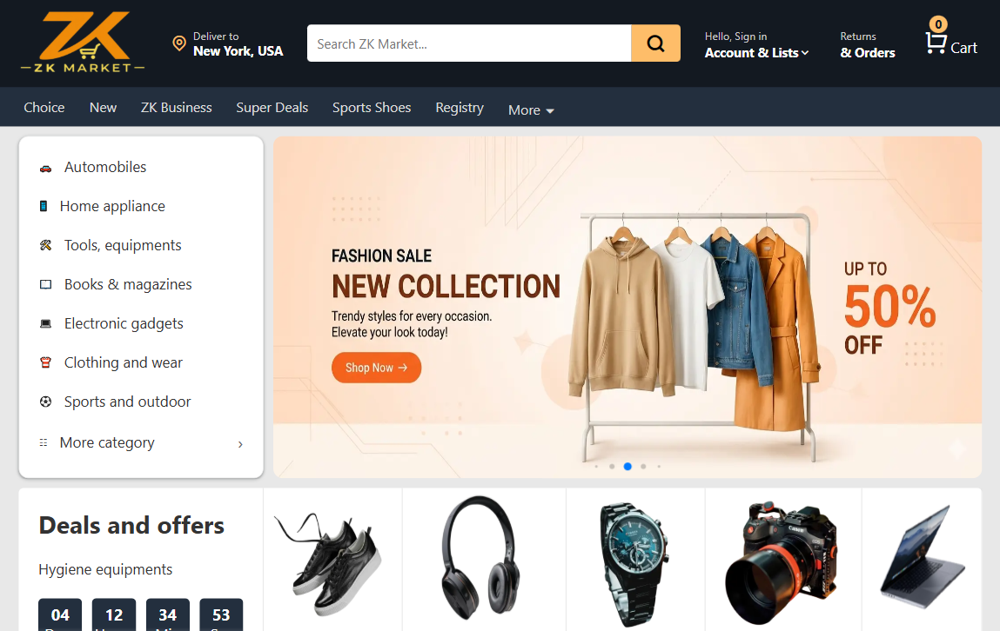
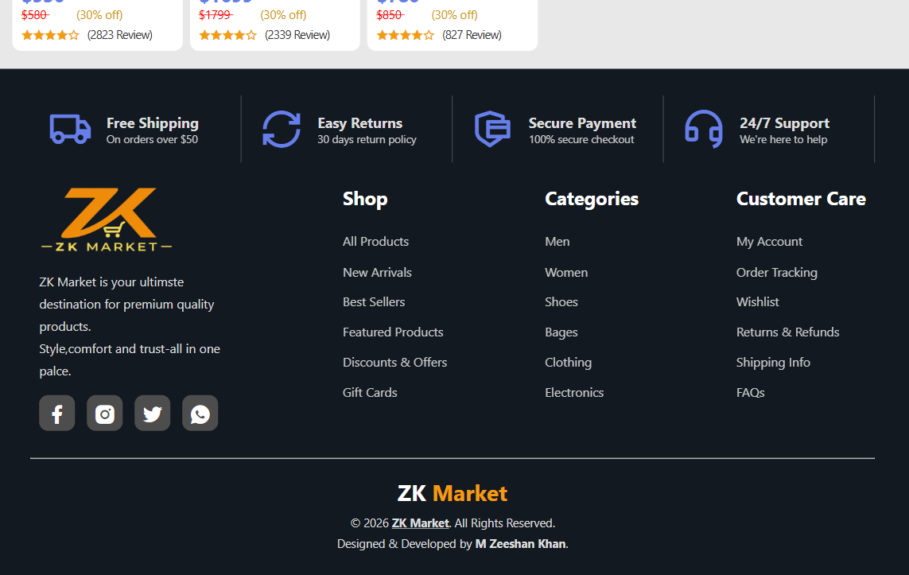
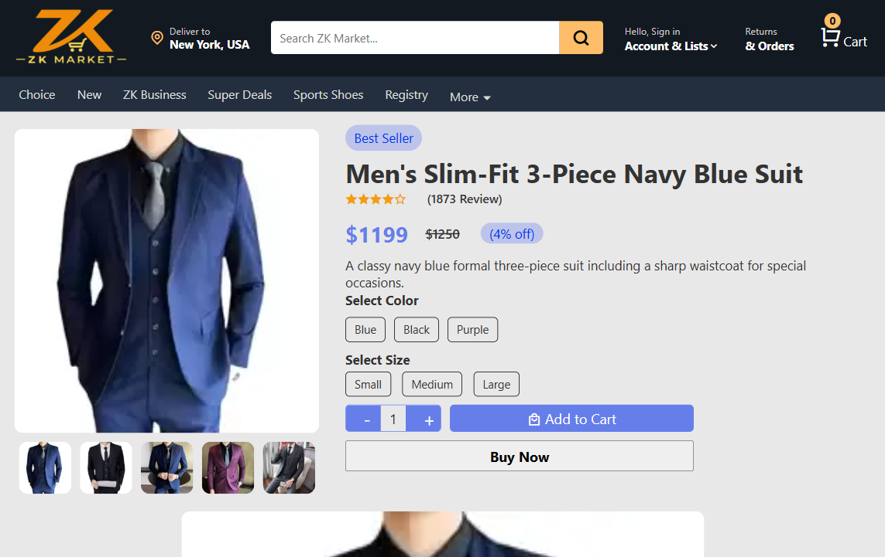
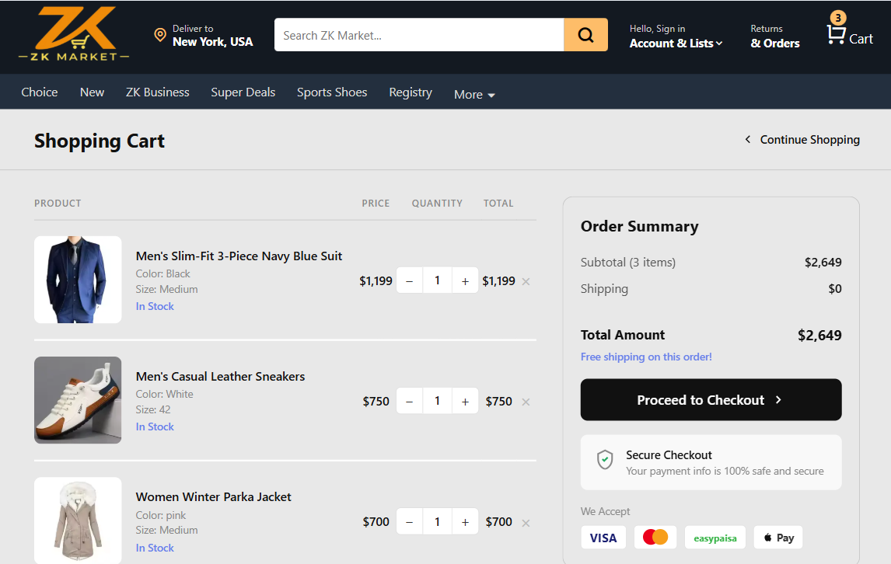
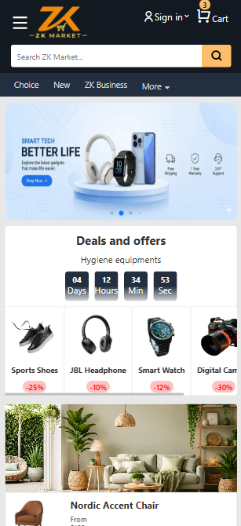
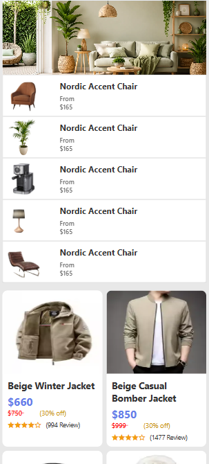
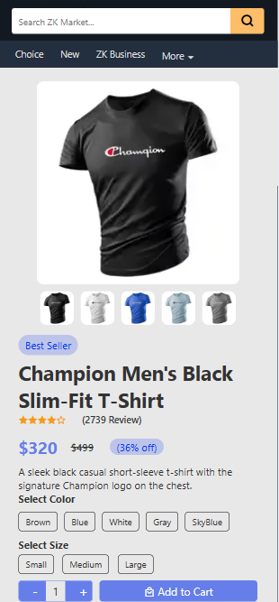
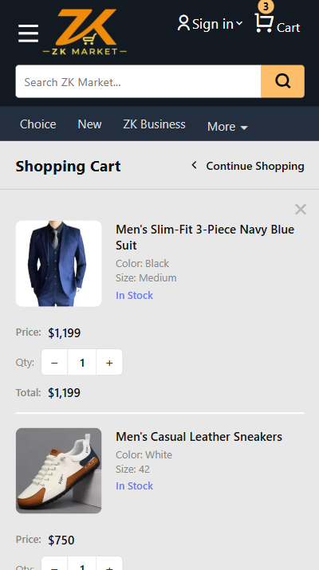

# 🛍️ ZK Market - E-Commerce Website

A modern and fully responsive e-commerce website built with HTML, CSS, and JavaScript. The project includes product listings, product detail pages, shopping cart functionality, image galleries, and a responsive user interface.

---

## 📸 Preview

### Desktop View
<p align="center">
  
  
  
  
  
</p>

### Mobile View
<p align="center">
  
  
  
  
</p>

---

# 🚀 Live Demo

🔗 https://zk-e-commerce.netlify.app/

---

## 🚀 Features

- Responsive Design (Mobile, Tablet & Desktop)
- Product Listing Page
- Product Details Page
- Multiple Product Images
- Shopping Cart Functionality
- LocalStorage Cart Persistence
- Cart Quantity Counter
- Product Ratings
- Mobile Navigation Menu
- Swiper.js Hero Slider
- Clean and Modern UI
- Fast Loading Performance

---

## 🛠️ Technologies Used

- HTML5
- CSS3
- JavaScript (ES6 Modules)
- LocalStorage API
- Swiper.js

---

## 📂 Project Structure

```text
ZK E-commerce/
│
├── index.html
├── product-detail.html
├── cart.html
│
├── assets/
│   ├── e-commerce Products
│   ├── Home-product img
│   ├── images
│   ├── product-img
│   └── screenshots
│
├── data/
│   ├── products-item.js
│
├── script/
│   ├── cart.js
│   ├── product.js
│   └── script.js
│
├── style/
│   ├── style.css
│   ├── product-detail.css
│   ├── cart.css
│   └── responsive.css
│
└── README.md
```

---

## 🛒 Shopping Cart

The cart system is powered by JavaScript and LocalStorage.

Features:

- Add products to cart
- Remove products from cart
- Update cart quantity
- Save cart data in browser storage
- Cart remains available after page refresh

---

## 📱 Responsive Design

The website is optimized for:

- Mobile Devices
- Tablets
- Laptops
- Desktop Screens

---

## 🎯 Learning Goals

This project was built to practice:

- DOM Manipulation
- JavaScript Modules
- Array Methods
- LocalStorage
- Responsive Web Design
- Dynamic Content Rendering
- E-Commerce UI Development

---

## 🔧 Installation

Clone the repository:

```bash
git clone https://github.com/mzeeshankhan-dev/ZK-E-commerce.git
```

Open the project folder:

```bash
cd ZK E-commerce
```

Run with Live Server or open `index.html` in your browser.


## 👨‍💻 Author

Developer Muhammad Zeeshan Khan

Frontend Developer

- HTML
- CSS
- JavaScript
- Responsive Web Design

## 📄 License

This project is created for educational and portfolio purposes.